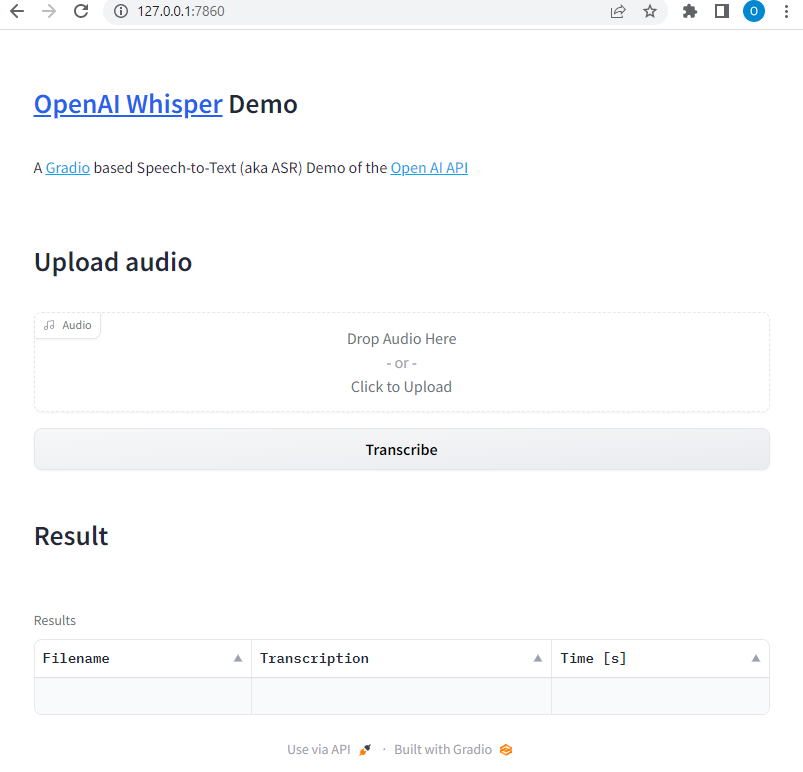
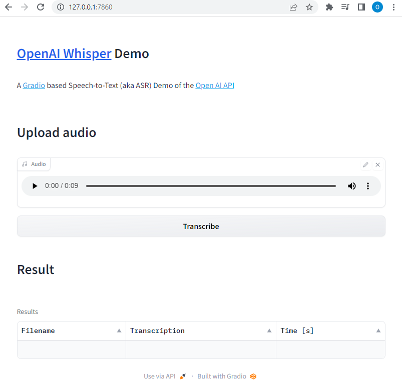
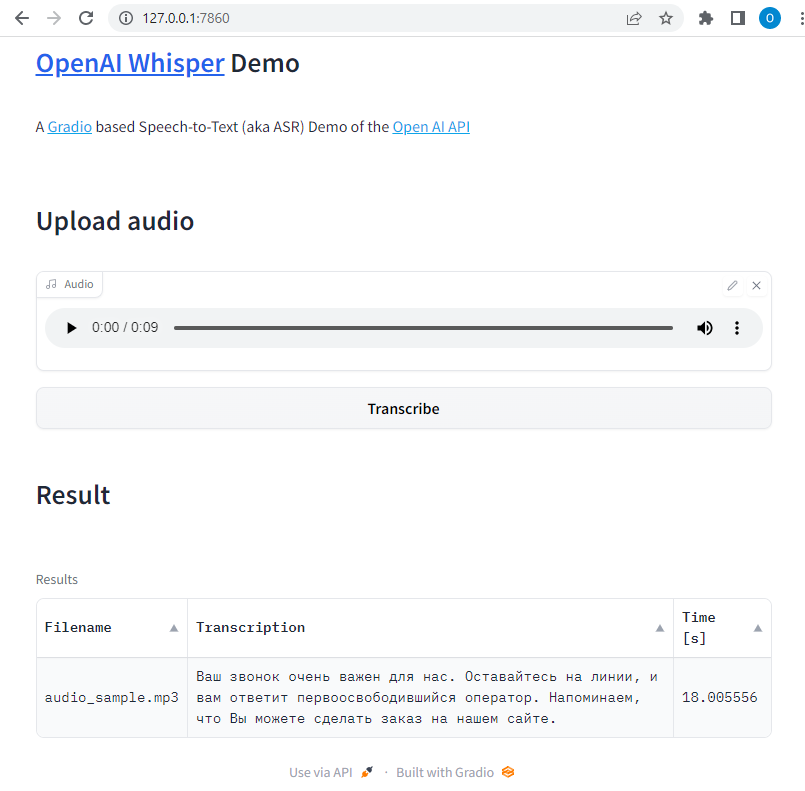

## Application to transcribe audio 

Install requirements:

``` bash
pip install -r requirements.txt
```

Application also requires the command-line tool ffmpeg to be installed on your system, which is available from most package managers:

```
# on Ubuntu or Debian
sudo apt update && sudo apt install ffmpeg

# on Windows using Chocolatey (https://chocolatey.org/)
choco install ffmpeg
```

```bash
python whisper_demo_api.py
```

Output example:
```bash
Running on local URL:  http://0.0.0.0:7860

To create a public link, set `share=True` in `launch()`.
task started for: audio_sample.mp3
task completed for: audio_sample.mp3
```
File uploads to OpenAI are currently limited to 25 MB and the following input file types are supported: mp3, mp4, mpeg, mpga, m4a, wav, and webm.

Application converts input audio file to mp3 before sending to OpenAI to work with aac, opus and ogg.


Web GUI:







config.json example:

```json
{
    "api_key": "open_api-key",
    "model_name": "whisper-1",
    "language": "uk"
}
```

config.json is optional and API key can be configured as environmet variable. Language will be autodetected (it takes more time)

On Windows PowerShell:

``` bash
$Env:OPENAI_API_KEY = "openai_api_key"
python whisper_demo_api.py
```

replacements.json example:

```json
{
    "word":"word_1"
}
```

## To check API usage

https://platform.openai.com/account/usage

## API reference

https://platform.openai.com/docs/api-reference/audio/create?lang=python
